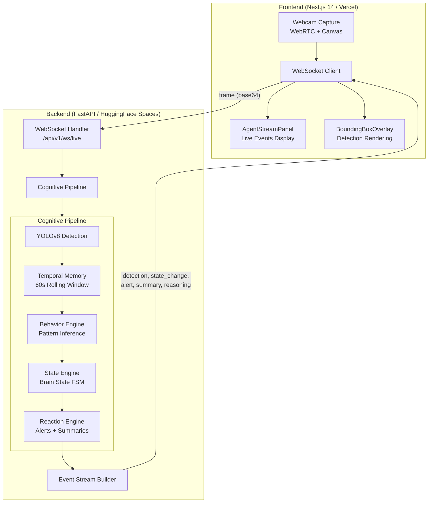

<div align="center">

# 🔮 VisionForge AI

**Visionary Agent Protocol**

Real-time Vision AI infrastructure that watches live video, detects objects, reasons over context, and streams cognitive intelligence instantly.

[](https://github.com/abhay-codes07/visionforge-ai/actions)
[](https://nextjs.org/)
[](https://fastapi.tiangolo.com/)
[](https://www.python.org/)
[](https://www.typescriptlang.org/)
[](https://www.docker.com/)
[](LICENSE)

[Live Frontend](https://visionaryai-jade.vercel.app) · [Live Backend API](https://abhayysingh-visionforge-backend.hf.space/api/v1/health) · [API Docs](https://abhayysingh-visionforge-backend.hf.space/docs)

</div>

---

## 🧠 What is VisionForge AI?

VisionForge AI is a **real-time multimodal cognitive vision agent platform**. It ingests webcam/video/image inputs, runs live object detection via YOLOv8, maintains temporal memory of observed scenes, infers high-level behaviors, tracks brain states with debounce logic, and generates streaming reasoning — all over WebSocket in real time.

Unlike simple detection tools, VisionForge AI has a **cognitive pipeline** that understands behavior *over time*:

```
Camera Frame → YOLO Detection → Temporal Memory → Behavior Engine
                                      → State Engine → Reaction Engine → Live Events
```

---

## 🌐 Live Deployment

| Service | URL |
|---------|-----|
| **Frontend** (Vercel) | [visionaryai-jade.vercel.app](https://visionaryai-jade.vercel.app) |
| **Backend API** (HuggingFace Spaces) | [abhayysingh-visionforge-backend.hf.space](https://abhayysingh-visionforge-backend.hf.space/api/v1/health) |
| **API Docs** (Swagger) | [/docs](https://abhayysingh-visionforge-backend.hf.space/docs) |

---

## ✨ Key Features

### Vision & Detection
- **Real-time webcam capture** via WebRTC + Canvas at configurable FPS
- **YOLOv8 object detection** with bounding boxes, labels, and confidence scores
- **Bounding box overlay rendering** on live video feed
- **VisionAgents SDK** integration path for multimodal reasoning (optional)

### Cognitive Intelligence
- **Temporal Memory** — 60-second rolling window of detection history per session
- **Behavior Engine** — rule-based inference over temporal patterns (working, phone usage, movement, idle, anomaly, room empty)
- **State Engine** — maps behaviors to brain states (FOCUSED, DISTRACTED, AWAY, SUSPICIOUS, ACTIVE, IDLE) with debounce thresholds to prevent flickering
- **Reaction Engine** — emits alerts, state change events, and periodic summaries
- **Cognitive Pipeline** — orchestrates the full loop: detection → memory → behavior → state → reaction → events

### Streaming & Real-time
- **WebSocket live event protocol** with typed events: `session`, `detection`, `reasoning`, `token`, `state_change`, `alert`, `summary`, `error`
- **Token-by-token streaming** for reasoning output
- **Server-Sent Events (SSE)** for REST-based streaming
- **Live Q&A** grounded in current video session state

### Infrastructure
- **Monorepo** with frontend + backend + Docker + CI
- **GitHub Actions CI** for lint, tests, and type checks
- **Docker Compose** for one-command local stack
- **Vercel + HuggingFace Spaces** production deployment

---

## 🎯 Demo Capabilities

| Mode | Description |
|------|-------------|
| **Security Monitoring** | Detect people/objects, track anomalies, generate real-time alerts |
| **Workspace Assistant** | Describe desk context, identify objects, answer questions about visible items |
| **Object Tracking** | Continuous detection updates with confidence overlays and temporal tracking |
| **Live Intelligence Feed** | Event stream panel showing detections, reasoning, state changes, and alerts |

---

## 🏗️ Architecture

### Monorepo Structure

```
visionforge-ai/
├── frontend/                    # Next.js 14 App Router
│   ├── app/                     # Pages: home, about, blog, contact
│   ├── components/              # UI components + live vision modules
│   │   ├── AgentStreamPanel.tsx  # Cognitive event stream panel
│   │   ├── BoundingBoxOverlay.tsx# Detection overlay on video
│   │   ├── WebcamStream.tsx     # WebRTC webcam capture
│   │   ├── home/                # Homepage sections + live vision hook
│   │   ├── layout/              # Navbar, Footer
│   │   └── ui/                  # Reusable UI primitives
│   ├── lib/                     # AI client SDK, site config
│   └── tests/                   # Vitest + Testing Library tests
│
├── backend/                     # FastAPI Python service
│   ├── app/
│   │   ├── api/                 # REST + WebSocket route handlers
│   │   │   ├── routes/          # health, vision, realtime, system
│   │   │   ├── vision.py        # Live vision endpoints
│   │   │   └── websocket.py     # WebSocket live stream handler
│   │   ├── core/                # Config, middleware, lifecycle, errors
│   │   ├── integrations/        # OpenAI vision client
│   │   ├── schemas/             # Pydantic request/response models
│   │   └── services/            # Business logic layer
│   │       ├── cognitive_pipeline.py  # Full cognition orchestrator
│   │       ├── temporal_memory.py     # Rolling detection history
│   │       ├── behavior_engine.py     # High-level behavior inference
│   │       ├── state_engine.py        # Brain state machine
│   │       ├── reaction_engine.py     # Alert/summary generator
│   │       ├── yolo_service.py        # YOLOv8 detection wrapper
│   │       ├── vision_service.py      # Vision analysis service
│   │       ├── live_stream_service.py # Live WebSocket processor
│   │       └── ...
│   └── tests/                   # Pytest test suite
│
├── docker/                      # Dockerfiles + docker-compose.yml
├── docs/                        # Technical documentation
├── scripts/                     # Smoke tests
└── .github/workflows/           # CI pipeline
```

### System Architecture Diagram



### Cognitive Pipeline Flow

```
┌─────────────┐     ┌──────────────────┐     ┌──────────────────┐
│ Camera Frame │────▶│  YOLOv8 Detect   │────▶│ Temporal Memory  │
│  (base64)   │     │ labels + boxes   │     │ 60s window       │
└─────────────┘     └──────────────────┘     └────────┬─────────┘
                                                       │
                    ┌──────────────────┐               │
                    │ Behavior Engine  │◀──────────────┘
                    │ WORKING, PHONE,  │
                    │ AWAY, ANOMALY... │
                    └────────┬─────────┘
                             │
                    ┌────────▼─────────┐     ┌──────────────────┐
                    │  State Engine    │────▶│ Reaction Engine  │
                    │ FOCUSED,         │     │ STATE_CHANGE     │
                    │ DISTRACTED,      │     │ ALERT            │
                    │ SUSPICIOUS...    │     │ SUMMARY          │
                    └──────────────────┘     └──────────────────┘
```

### Brain States

| State | Trigger | Description |
|-------|---------|-------------|
| 🎯 **FOCUSED** | Working behavior detected consistently | User actively working at workstation |
| 📱 **DISTRACTED** | Phone usage detected | User on phone during work session |
| 🚪 **AWAY** | Room empty for threshold period | No person detected in frame |
| ⚠️ **SUSPICIOUS** | Anomaly detected | Unusual objects or patterns |
| 🏃 **ACTIVE** | Active movement detected | Moving around the scene |
| ⏸️ **IDLE** | No meaningful activity | Person present but inactive |
| ⏳ **INITIALIZING** | System starting up | No data collected yet |

---

## 🛠️ Tech Stack

### Frontend

| Layer | Technology |
|-------|-----------|
| Framework | Next.js 14 (App Router) |
| Language | TypeScript 5.7 |
| Styling | TailwindCSS 3.4 |
| Animations | Framer Motion |
| Icons | Phosphor Icons |
| Testing | Vitest + Testing Library |
| Deployment | Vercel |

### Backend

| Layer | Technology |
|-------|-----------|
| Framework | FastAPI 0.128 |
| Language | Python 3.10+ |
| Object Detection | YOLOv8 (Ultralytics) |
| AI Reasoning | OpenAI SDK (gpt-4.1-mini) |
| Validation | Pydantic v2 |
| Real-time | WebSockets + SSE |
| Testing | Pytest + HTTPX |
| Deployment | HuggingFace Spaces (Docker) |

### Infrastructure

| Layer | Technology |
|-------|-----------|
| Containers | Docker + Docker Compose |
| CI/CD | GitHub Actions |
| Frontend Hosting | Vercel |
| Backend Hosting | HuggingFace Spaces |
| Repo Model | Monorepo (npm workspaces) |

---

## 🚀 Getting Started

### Prerequisites

- **Node.js** >= 20.0.0
- **Python** >= 3.10
- **Docker** (optional, for containerized setup)

### 1. Clone

```bash
git clone https://github.com/abhay-codes07/visionforge-ai.git
cd visionforge-ai
```

### 2. Environment Files

```bash
# Windows PowerShell
copy backend\.env.example backend\.env
copy frontend\.env.example frontend\.env.local
```

Edit `backend/.env` to configure:
```env
OPENAI_API_KEY=your-key-here      # or "replace-me" for stub mode
OPENAI_ENABLED=false               # set true to enable AI reasoning
YOLO_MODEL=yolov8n.pt
YOLO_CONFIDENCE_THRESHOLD=0.35
```

### 3. Install Dependencies

```bash
# Frontend
npm install

# Backend
python -m venv backend/.venv
backend/.venv/Scripts/Activate.ps1   # Windows
# source backend/.venv/bin/activate  # macOS/Linux
pip install -e "backend[dev]"
```

### 4. Run Development Servers

```bash
# Frontend (http://localhost:3000)
npm run dev:frontend

# Backend (http://localhost:8000)
npm run dev:backend
```

### 5. Run with Docker (Alternative)

```bash
npm run up       # Build and start all services
npm run logs     # View logs
npm run down     # Stop all services
```

---

## 🧪 Testing

```bash
# Frontend lint
npm run lint:frontend

# Frontend tests
npm run test:frontend

# Backend tests
npm run test:backend
```

---

## 📡 API Endpoints

### REST

| Method | Endpoint | Description |
|--------|----------|-------------|
| `GET` | `/api/v1/health` | Health check |
| `GET` | `/api/v1/system/status` | System status + uptime |
| `GET` | `/api/v1/vision/capabilities` | Supported media types & AI config |
| `POST` | `/api/v1/vision/analyze` | Analyze image/video (JSON response) |
| `POST` | `/api/v1/vision/analyze/stream` | Analyze with SSE token streaming |
| `POST` | `/api/v1/vision/question` | Q&A over analyzed content |
| `POST` | `/api/v1/vision/question/stream` | Q&A with SSE token streaming |
| `GET` | `/api/v1/live/session/{id}` | Live session snapshot |
| `POST` | `/api/v1/live/question` | Ask question in live session |

### WebSocket

| Endpoint | Description |
|----------|-------------|
| `WS /api/v1/ws` | General vision WebSocket |
| `WS /api/v1/ws/live` | Live cognitive vision agent |

#### Live WebSocket Protocol

**Inbound Messages:**
```json
{ "type": "frame", "payload": { "session_id": "...", "frame_id": "...", "image_base64": "...", "demo_mode": "workspace" } }
{ "type": "question", "session_id": "...", "question": "What do you see?" }
```

**Outbound Events:**
```json
{ "type": "detection", "session_id": "...", "detections": [...], "content": "..." }
{ "type": "state_change", "session_id": "...", "data": { "new_state": "FOCUSED", "previous_state": "IDLE", "confidence": 0.85, "reason": "..." } }
{ "type": "alert", "session_id": "...", "data": { "level": "warning", "title": "...", "message": "..." } }
{ "type": "summary", "session_id": "...", "data": { "text": "...", "state": "FOCUSED", "confidence": 0.9 } }
{ "type": "reasoning", "session_id": "...", "content": "..." }
{ "type": "token", "session_id": "...", "content": "..." }
```

---

## 🌍 Deployment

### Frontend → Vercel

The frontend is deployed on Vercel with automatic deploys on push to `main`.

| Setting | Value |
|---------|-------|
| Root Directory | `frontend` |
| Framework | Next.js |
| Env: `NEXT_PUBLIC_API_BASE_URL` | `https://abhayysingh-visionforge-backend.hf.space` |
| Env: `NEXT_PUBLIC_WS_URL` | `wss://abhayysingh-visionforge-backend.hf.space/api/v1/ws` |

### Backend → HuggingFace Spaces

The backend runs as a Docker container on HuggingFace Spaces (free CPU tier).

| Setting | Value |
|---------|-------|
| SDK | Docker |
| Port | 7860 |
| Hardware | Free CPU basic (2 vCPU, 16GB RAM) |

---

## ⚡ Performance Controls

| Setting | Default | Description |
|---------|---------|-------------|
| `LIVE_FRAME_MAX_FPS` | 8 | Max frames per second sent to backend |
| `LIVE_FRAME_QUEUE_SIZE` | 4 | Bounded async queue for frame processing |
| `YOLO_CONFIDENCE_THRESHOLD` | 0.35 | Minimum detection confidence |
| Temporal Memory Window | 60s | Rolling detection history duration |
| State Debounce | 2-3s | Time before committing a state change |
| Summary Interval | 10s | Periodic cognitive summary frequency |

---

## 🗺️ Roadmap

- [ ] Multi-agent collaboration for specialized scene roles
- [ ] GPU acceleration for higher FPS inference
- [ ] Edge deployment profile for low-bandwidth environments
- [ ] Automated anomaly detection alerting with webhooks
- [ ] Persisted session timelines and replay
- [ ] Multi-camera support with scene correlation
- [ ] Custom behavior rule configuration via UI

---

## 🤝 Contributing

Contributions are welcome. Keep changes modular, typed, and test-backed.

1. Fork the repository
2. Create a feature branch (`git checkout -b feat/your-feature`)
3. Run lint and tests locally (`npm run lint:frontend && npm run test:frontend`)
4. Commit with conventional commits (`feat:`, `fix:`, `docs:`, etc.)
5. Open a focused pull request with clear scope

---

## 📄 License

MIT — see [LICENSE](LICENSE) for details.

---

## 👤 Maintainer

**Abhay Singh** · [@abhay-codes07](https://github.com/abhay-codes07)

Repository: [github.com/abhay-codes07/visionforge-ai](https://github.com/abhay-codes07/visionforge-ai)
